# EntryLevel-Capstone-Projects: Udemy Datasets and Video Games Analysis

---

## Professional Background
Hi, my name is Mikail Oluwasegun Yusuf. I hold a bachelor’s and master’s degree of science in Geology and Engineering Geology/hydrogeology from Obafemi Awolowo University and the University of Ibadan respectively.
My undergraduate and postgraduate theses have made me understand the important of data collection and analysis, as I collected and analyzed geological data for decision making to solve the effect of gully erosion spread in Auchi and its environs in Edo state, Nigeria.
As a trained geologist, I was trained to understand the hidden stories written on rock exposures, so that is how I look at big data sets to me as a big rock. I want to understand the hidden fact. Finding pattern nobody else sees is the challenge to me, and hence my interest in data analysis.

**Outline**
- Professional Background									
- Table of Contents										
- Udemy Project Description									
- The Problem											
- Findings											
- Analysis											
- Conclusion											
- Capstone Project Description									
- Data Design											
- Findings											
- Data Analysis											
- Conclusion

## Udemy Project Description
I am a data analyst at Udemy, which is an online tutor company. I was tasked by the manager to present the data on course revenue to understand how the business model can be better and identify ways to increase the company revenue, monitor the performance of different courses, and identify the most popular of all the course and the effect of content duration on the course price.

### Methodology
Consumer subscription data sets obtained from Udemy between the years 2014 and 2017 on four different subject areas was studied. The data cleaning was done by removing duplicates, blank cells expunged and inconsistent data adjusted using google sheets. The clean data was then analysed using Tableau to create necessary visuals. The aims of the study are to identify possible revenue increase opportunities and track performance on the following topics; Web Development, Graphic Design, Business Finance, and Musical Instruments from the insights gotten from the data visualization.

### Result and Conclusion 
- The analysed data shows that Web Development is the most popular of all the subjects and also provided the highest revenue of $24,316,800.00. 
- There are potential opportunities to increase revenue further in web development considering that it was responsible for most of the revenue generated and most popular courses between 2014 and 2017. 

## The Problem
The business problem is to understand the trend of individual courses in term of performance in order to know the most popular course, what course can the price be increased and which course(s) should they tailor their marketing and advertising towards, in other to increase the company revenue generation. The data analysis findings are expected to be provided within four weeks.

Sales data from the following topics; Web Development, Graphic Design, Business Finance, and Musical Instruments will help in providing requisite information. The data is provided in descriptive, tabular, and pictorially to enable its understanding. 

The analysis seeks to understand the subject with the total number of subscribers, the subject with the highest price, and the subject with the highest number of positive reviews to understand the performance of the respective subjects.

## Findings
*Finding 1*
Table 1 and figure 1 below shown the Total Subscription by Subject
According to the provided data on the different course titles, **the largest percentage (67.87%) of the subscribers enrolled in Web Development. The total number of subscribers is 7,981,935.**

*Table 1*
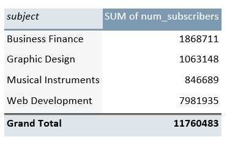
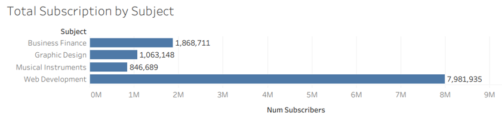

Figure 1: Chart Showing Total Suscription by Subject

*Finding 2*
Figure 2: Variation of Average Content Duration/Price/Students with Subjects
**The analysis showed that Web Development has the highest average Content Duration, average price and average Number of Subscribers compared to the other subjects.**
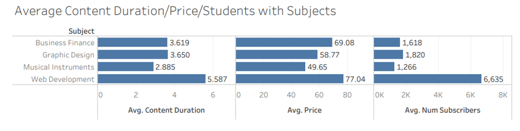

Figure 2: Chart Showing Average Content Duration, Price and Avg. Number of Students with Subjects.

*Finding 3*
Figure 3: Number of Free and Paid Courses
**The number of paid courses across the subject is more than the free courses. Web development the highest paid course follow by Business Finance and this has the same trend with the free courses.**
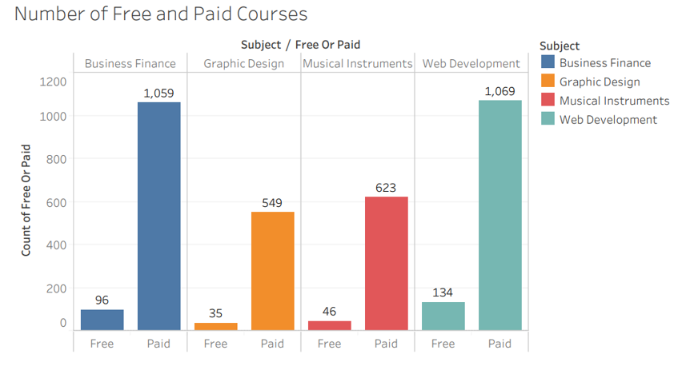

*Finding 4*
Figure 4: Web Development Average Price at Different Level
**The average price of web development ranges from 67.14 to 85.07 across the level and it increases from beginner level to intermediate, intermediate level has the highest average price while that of expert level is low.**
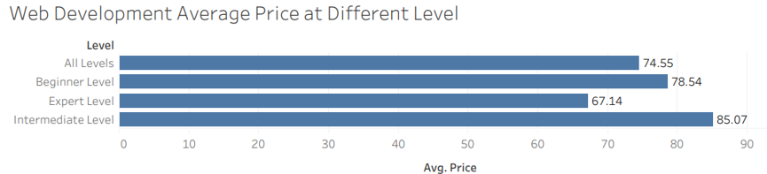

*Finding 5*
Figure 5: The 20 most Popular Courses
**Learn HTML5 Programming from Scratch and QuickStart AngularJS are the free beginner courses among the top 20 most popular course with the total number of subscribers and content duration are 268923, 64128 and 10.50, 1.50 respectively.**

*Finding 6*
Figure 6: Content Duration and Price
**The analysis shown that there is no direct relationship between content duration and price, as the trend is random in nature.**
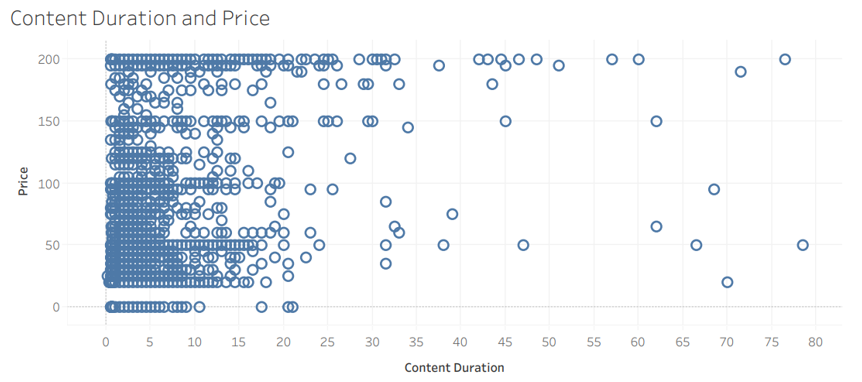

## Analysis
The analysed data shows that Web Development is the most popular subject, it has the highest number of subscribers and thus generated the highest revenue to the company between 2014 and 2017. Web Development also has the highest average course price and average content duration.
It also has the highest free and paid courses, this shows that the most popular course under web development is free, hence, this can lead to reduction in revenue as it has the highest number of subscribers. 
The essence of the ‘why’ analysis is to establish the root cause of the identified problems and fix them. The number of questions asked enabled the establishment of the root cause of the identified problem. The analysis results suggested that there is an opportunity to increase sales across the different regions.

**Why Analysis**
*Problem: Reduction in Revenue*

1.	Why? High Number of Free Courses
2.	Why? Low Number of Subscribers
3.	Why? Courses are too Expensive
4.	Why? Most of the Courses are at Advance Level

## Conclusion
Web Development generated the highest revenue but there is still great opportunity to generate more revenue as the highest number of subscribers goes to a free course under web development, hence, the free courses can be slightly priced. More course on intermediate level should be published
More Marketing and advertisement should be done towards Musical instruments courses as it has the least number of subscribers.
***

# Video Games Project 

## Project Description
I analysed a dataset consists of several video games with some sales info, customer rating, platform and producer details, with sales greater than 100,000 copies. There are 16,599 records with no duplicate. 2 records were dropped due to incomplete information. I did a quick review of the data, identified some problems and the likely causes of the problems with their possible impacts, I examined the most sold games in the global perspective, then examined the games in terms of genre and platform, the game genres according to the region, and finally the year the most sold games are released and their publishers. Also, some information is given about games, publishers and platforms.

### Methodology
The data was checked for duplicate, blank cells, and inconsistent data adjusted using Google worksheet, however, the names were inconsistent and set accordingly, the clean data was late analysed using Tableau to create necessary visuals.
The study aims to establish user rankings and track performance on video game sales, establish which of the regions generated the highest revenue, identify top publisher and identify possible revenue increase opportunities.

### Results/Conclusion
The publishing of games through Nintendo drives up prospective video game sales as 89.19% of the top 20 games have been through Nintendo.
More marketing and advertising strategies should be put in place for games with puzzle, adventure and strategy genres as they generate the least revenue globally.

## Data Design
I have analysed revenue generated on video game sales over different genres with recorded sales of over 100,000 copies. The data were checked for duplicates, blank cells and inconsistent data adjusted using google sheets. The clean data was analysed using Tableau to create necessary visuals. The study aims to establish the performance on video game sales, establish which of the regions generated the highest revenue, and identify possible revenue increase opportunities.

## Findings
*Finding 1*.
Figure 7: Revenue generated and number of games produced by genres.
**Action games generated the highest revenue and also the highest number of games produced so far while strategy games generated the least revenue and puzzle games produced the least number of games.**
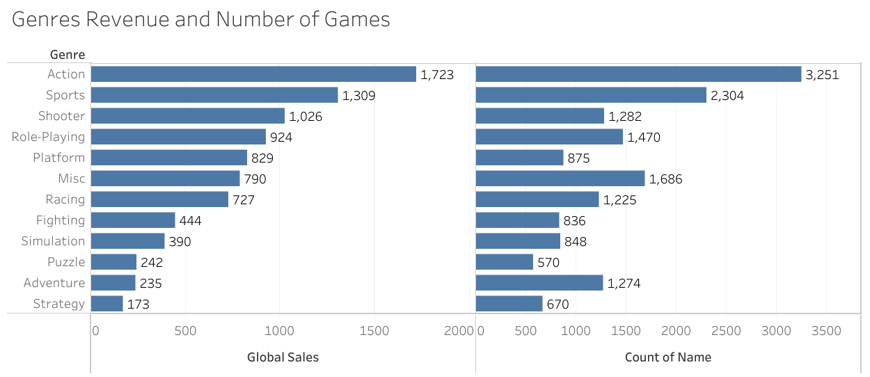

*Finding 2*.
Figure 8: Highest generated revenue by platform.
**PS2 game generated the highest revenue globally**
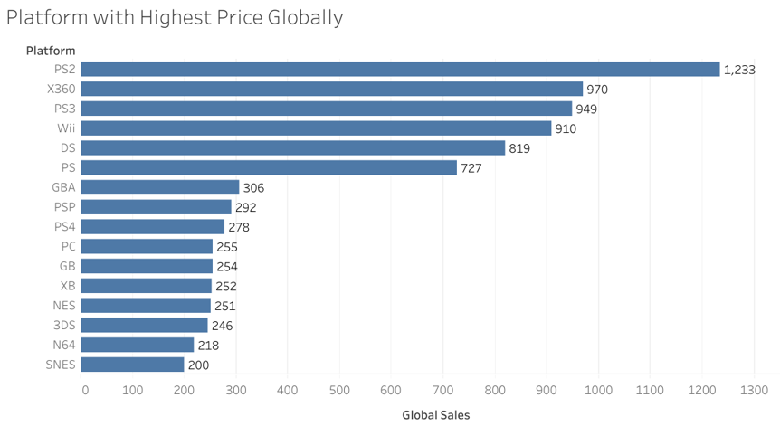

*Finding 3*.
Figure 9: The year with most released games.
**2009 was the year with the highest number of games released, which account to 1,431 games.**
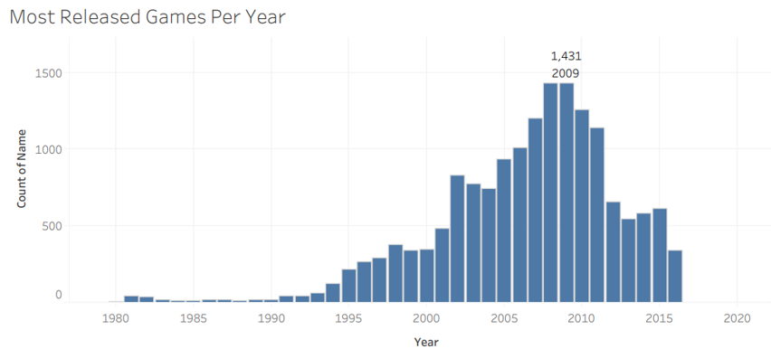

*Finding 4*.
Figure 10: Global sales by year.
**Started peaking in 1995 after a stagnant year from 1980 till 1995. 2008 was the highest game sold with more than 600 million. Decreasing right after until 2017. During this period 1994 - 2008, the video game industry experienced significant growth. By mid 1990s, the industry had a major shift into 3D graphics and the release of consoles such as: Sony PlayStation, Sega Saturn and Nintendo 64.**
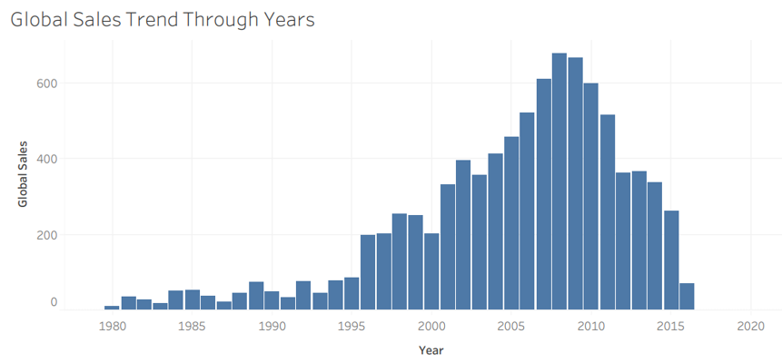

*Finding 5*.
Figure 11: Overview Sales Compares Between Genres.
**From the figure below, we can see that North America (NA) has the highest sales across the genres compared with other regions, except for JP, Role-Playing is the highest sale. Meanwhile, Action and Sport sales higher than the others. The highest sales for NA are the Action genre.  Also, North America have highest sales for every genre. Now we know where the money come from!**
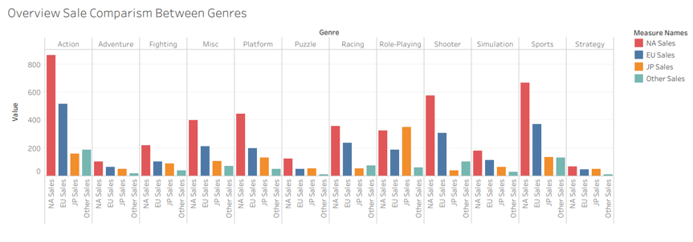

*Finding 6*.
Figure 12: Overview sales comparison between platform.
**PS2 and X360 sales higher than the others. And same like the previous chart, North America dominant in sales**
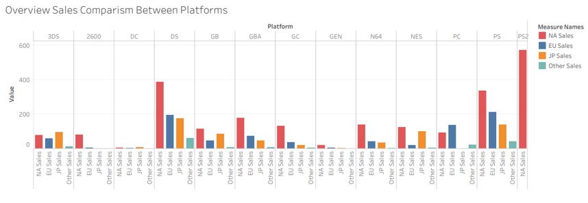
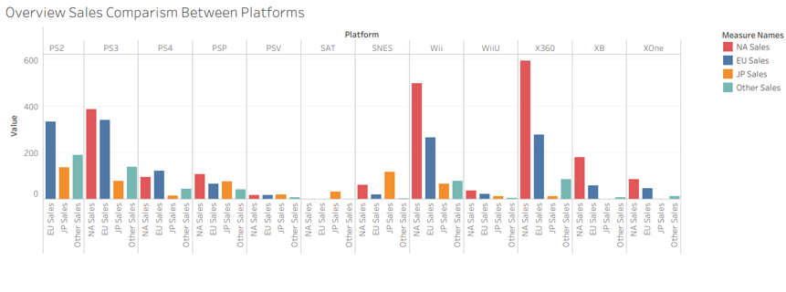

*Finding 7*.
Figure 13: Top 20 Publishers. 
**Electronic Arts is the highest by the number of publisher while Nintendo is the highest by global sales (Figure 14).**
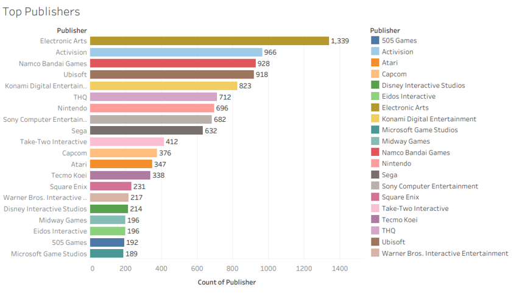
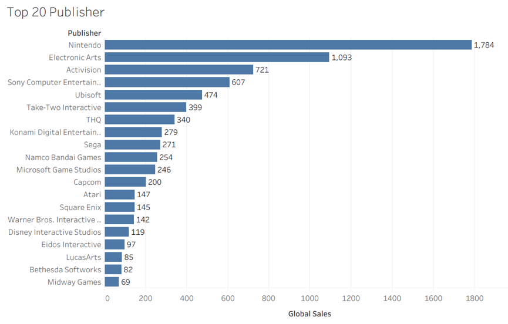

## Analysis
The first insight gotten from the data analysis is a possible decline in video game sales. This decline may result from a high initial cost or lack of awareness around the regions.

My inferences include reduction in revenue and lack of Feedback.
The essence of the 5 why analysis is to establish the root cause of the identified problems and fix them. 
There is an opportunity to increase sales across the different regions.

### Why Analysis
*Problem: Reduction in Sales*

1.	Why? Lack of Awareness of Product
2.	Why? Poor Marketing and Advertising Strategies
3.	Why? Too Expensive to Operate
4.	Why? Absence of Incentives from the Government

**Key Take aways from the Analysis:**
- Over the last few years there is decrease in the games which have crossed 100K copies sales.
- In fact, last 5-6 years has seen decrease in the revenue.
- Nintendo is the top most publisher by revenue.
- Action is the top most genre by revenue.
- Action is ruling the market from 2001
- Play Station is the most popular platform
- EA is the top most publisher by number of releases.
- North America and Europe contribute 75% of the market share by revenue.

## Conclusion
Application of incentives from the government to aid production cost and to promote effective marketing and advertisement in order to promote global awareness.
The publishing of games through Nintendo drives up prospective video game sales as 89.19% of the top 20 games have been through Nintendo. Nintendo seems to have what it takes to drive up sales. Hence, Future publishing of video games is recommended to be made through them. More action games should be produced as it generated enormously to the revenue. There is an opportunity to increase sales across the different regions.

